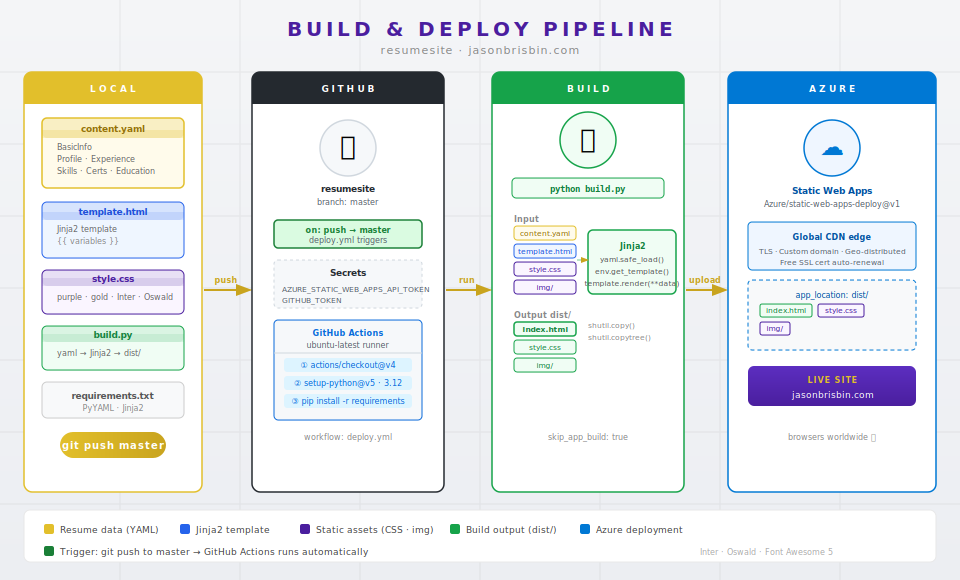
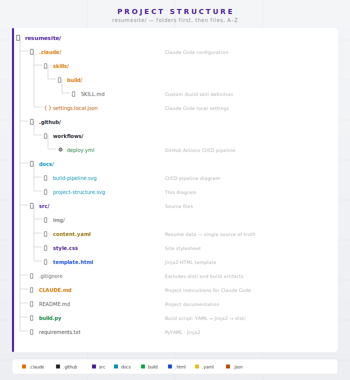

# Resume Site — jasonbrisbin.com

A static resume site built with Python, Jinja2, and deployed automatically to Azure Static Web Apps via GitHub Actions. Live at [jasonbrisbin.com](https://jasonbrisbin.com). The site was redesigned from the ground up by Jason Brisbin working exclusively with [Claude Code](https://claude.ai/claude-code).

## Background

This project replaced a previous Hugo-based site that had grown unnecessarily complex for what was ultimately a single-page resume.

The Hugo setup required:
- A pinned Hugo binary (v0.92.0), Node.js, and Docker just to run locally
- Two git submodules for external themes — both had to be initialized before any template work could happen
- An opaque build process where Azure Static Web Apps was expected to auto-detect and invoke Hugo (no explicit build step in CI/CD)

The Hugo site was driven by a `data/content.yaml` file which was reused in this solution. The theme was just a layer of Go-template indirection sitting between that data and the HTML output.

This rewrite cuts directly to what matters:

| Concern           | Hugo (before)                             | Python/Jinja2 (now)               |
| ----------------- | ----------------------------------------- | --------------------------------- |
| Dependencies      | Hugo binary + Node.js + Docker            | 2 pip packages                    |
| Submodules        | 2 (theme repos)                           | None                              |
| Build command     | Implicit (Azure magic)                    | `python build.py`                 |
| Template language | Go templates (inside a submodule)         | Jinja2 (in `src/`)                |
| CI/CD complexity  | 79-line workflow with commented-out steps | 34-line workflow, no magic        |
| Local setup       | Install Hugo, init submodules             | `pip install -r requirements.txt` |

The entire build pipeline is now 50 lines of readable Python. Any developer with standard tools can clone the repo, run one command, and have a working local preview — no Hugo version management, no submodule initialization, no Docker required.

## How It Works

Resume content is maintained in a single YAML file (`src/content.yaml`). A Python build script reads that file and renders it through a Jinja2 HTML template, producing a self-contained static site in `dist/`. Pushing to `master` triggers a GitHub Actions workflow that builds the site and deploys it directly to Azure.



## Project Structure



## Local Development

```bash
pip install -r requirements.txt
python build.py
# Open dist/index.html in your browser
```

## Built with Claude Code

This project was developed using [Claude Code](https://claude.ai/claude-code), Anthropic's AI-powered CLI for software engineering. Claude Code was used throughout the development cycle:

- **Architecture decisions** — Claude helped design the YAML → Jinja2 → static HTML pipeline, keeping the toolchain minimal and the content format easy to maintain.
- **Template and styling** — The two-column layout, Font Awesome icon integration, and CSS were developed interactively with Claude.
- **CI/CD pipeline** — The GitHub Actions workflow for automated Azure deployment was written with Claude's assistance.
- **Iterative content updates** — Resume content changes are made by editing the YAML file, with Claude available to assist with formatting, structure, and copy.

Using Claude Code as a development partner is itself a demonstration of practical AI tool fluency — the ability to collaborate with AI systems effectively to ship real software faster and with higher quality.
